# 📧 Sistema de Notificaciones SGH - Documentación Completa

## 🎯 **Visión General**

El Sistema de Notificaciones del **SGH (Sistema de Gestión de Horarios)** es una plataforma completa y elegante para la comunicación institucional. Diseñado con plantillas HTML modernas, envío asíncrono, reintentos automáticos y logging detallado, ofrece una experiencia de comunicación moderna y confiable.

**Características principales:**
- ✅ **Envío dual**: Correo electrónico + Notificaciones In-App
- ✅ **100% automatizado** por roles de usuario
- ✅ **Plantillas HTML personalizadas** con diseño responsive
- ✅ **WebSocket en tiempo real** para React Web
- ✅ **APIs REST completas** para React Native
- ✅ **Reintentos automáticos** ante fallos SMTP
- ✅ **Logging completo** de auditoría
- ✅ **Coordinador con control total** del sistema

---

## 🎨 **Características del Sistema**

### ✨ **Diseño y UX**
- **Plantillas HTML modernas** con gradientes y animaciones sutiles
- **Responsive design** compatible con móviles y desktop
- **Paleta de colores corporativa** por rol de usuario
- **Animaciones CSS** para mejor experiencia visual
- **Tipografía moderna** (Segoe UI, sans-serif)

### 🔧 **Funcionalidades Técnicas**
- **Envío asíncrono** con JavaMailSender y pool de hilos
- **Reintentos automáticos** con backoff exponencial (hasta 3 intentos)
- **Logging completo** de todas las operaciones con SLF4J
- **Validación de tipos** por rol de usuario
- **WebSocket STOMP** para notificaciones en tiempo real
- **Manejo de errores robusto** con excepciones controladas

### 📊 **Estadísticas y Monitoreo**
- Dashboard de estadísticas en tiempo real
- Logs detallados con timestamps y niveles
- Métricas de éxito/fallo por tipo y rol
- Historial completo de envíos con auditoría
- Contadores de reintentos y tiempos de respuesta

---

## 👥 **Roles y Notificaciones Disponibles**

### 🎓 **ESTUDIANTE** (Color: Verde #4CAF50)
**Icono:** 🎓 | **Enfoque:** Información académica y horarios

#### Tipos de notificación:
1. **`STUDENT_SCHEDULE_ASSIGNMENT`** - Asignación de horario nuevo
   - **Propósito:** Informar asignación inicial de clases
   - **Contenido:** Detalles del horario, materias, profesores
   - **Acción:** "Acceder al Sistema"

2. **`STUDENT_SCHEDULE_CHANGE`** - Cambio en horario existente
   - **Propósito:** Notificar modificaciones en clases
   - **Contenido:** Cambios específicos, nuevas fechas/horas
   - **Acción:** "Acceder al Sistema"

3. **`STUDENT_CLASS_CANCELLATION`** - Cancelación de clase
   - **Propósito:** Informar suspensión temporal de clases
   - **Contenido:** Motivo, fecha alternativa si aplica
   - **Acción:** "Acceder al Sistema"

---

### 👨‍🏫 **MAESTRO** (Color: Azul #2196F3)
**Icono:** 👨‍🏫 | **Enfoque:** Gestión académica y clases

#### Tipos de notificación:
1. **`TEACHER_CLASS_SCHEDULED`** - Nueva clase programada
   - **Propósito:** Confirmar asignación de nueva clase
   - **Contenido:** Detalles de la clase, horario, salón
   - **Acción:** "Acceder al Sistema"

2. **`TEACHER_CLASS_MODIFIED`** - Modificación en clase existente
   - **Propósito:** Informar cambios en clases asignadas
   - **Contenido:** Cambios específicos en horario/lugar
   - **Acción:** "Acceder al Sistema"

3. **`TEACHER_CLASS_CANCELLED`** - Clase cancelada
   - **Propósito:** Notificar suspensión de clase
   - **Contenido:** Motivo y reprogramación si aplica
   - **Acción:** "Acceder al Sistema"

4. **`TEACHER_AVAILABILITY_CHANGED`** - Cambio en disponibilidad
   - **Propósito:** Actualizar estado de disponibilidad
   - **Contenido:** Nuevos horarios disponibles
   - **Acción:** "Acceder al Sistema"

---

### 👔 **DIRECTOR_DE_AREA** (Color: Púrpura #9C27B0)
**Icono:** 👔 | **Enfoque:** Gestión administrativa y alertas

#### Tipos de notificación:
1. **`DIRECTOR_SCHEDULE_CONFLICT`** - Conflicto de horarios detectado
   - **Propósito:** Alertar sobre conflictos en asignaciones
   - **Contenido:** Detalles del conflicto, afectados
   - **Acción:** "Panel de Control"

2. **`DIRECTOR_AVAILABILITY_ISSUE`** - Problema en disponibilidad
   - **Propósito:** Reportar problemas de recursos
   - **Contenido:** Recursos insuficientes, sobrecargas
   - **Acción:** "Panel de Control"

3. **`DIRECTOR_SYSTEM_INCIDENT`** - Incidencia importante del sistema
   - **Propósito:** Alertar sobre problemas críticos
   - **Contenido:** Detalles técnicos, impacto esperado
   - **Acción:** "Panel de Control"

---

### ⚙️ **COORDINADOR** (Color: Naranja #FF5722)
**Icono:** ⚙️ | **Enfoque:** Control total del sistema

#### Tipos de notificación:
1. **`COORDINATOR_GLOBAL_UPDATE`** - Actualización global de horarios
   - **Propósito:** Informar cambios masivos en el sistema
   - **Contenido:** Alcance de cambios, impacto general
   - **Acción:** "Panel de Administración"

2. **`COORDINATOR_SYSTEM_ALERT`** - Alerta del sistema
   - **Propósito:** Notificar eventos importantes del sistema
   - **Contenido:** Alertas de mantenimiento, actualizaciones
   - **Acción:** "Panel de Administración"

3. **`COORDINATOR_CHANGE_CONFIRMATION`** - Confirmación de cambio realizado
   - **Propósito:** Confirmar aplicación exitosa de cambios
   - **Contenido:** Detalles de cambios aplicados
   - **Acción:** "Panel de Administración"

4. **`COORDINATOR_MAINTENANCE_ALERT`** - Mantenimiento programado
   - **Propósito:** Informar sobre mantenimientos del sistema
   - **Contenido:** Horarios, duración, impacto esperado
   - **Acción:** "Panel de Administración"

---

### 📢 **GENERAL** (Todos los roles - Color: Gris #6c757d)
**Icono:** 📢 | **Enfoque:** Comunicados institucionales

#### Tipos de notificación:
1. **`GENERAL_SYSTEM_NOTIFICATION`** - Notificación general del sistema
   - **Propósito:** Comunicados generales a toda la institución
   - **Contenido:** Anuncios importantes, recordatorios
   - **Acción:** "Acceder al Sistema"

---

## 🎨 **Diseño de Plantillas HTML**

### **Elementos Comunes de Diseño:**

#### **Header con Gradiente**
```css
background: linear-gradient(135deg, [COLOR_ROL] 0%, [COLOR_SECUNDARIO] 100%);
```

#### **Animaciones**
- **slideIn:** Entrada suave desde arriba
- **float:** Elementos decorativos flotantes
- **pulse:** Indicadores de estado animados
- **hover effects:** Interacciones sutiles

#### **Layout Responsive**
- **Grid system** para información estructurada
- **Media queries** para móviles
- **Flexbox** para alineaciones perfectas

### **Paleta de Colores por Rol:**

| Rol | Color Principal | Color Secundario | Color de Acento | Icono |
|-----|----------------|------------------|-----------------|-------|
| **Estudiante** | `#4CAF50` | `#45a049` | `#388E3C` | 🎓 |
| **Maestro** | `#2196F3` | `#1976D2` | `#1565C0` | 👨‍🏫 |
| **Director** | `#9C27B0` | `#7B1FA2` | `#6A1B9A` | 👔 |
| **Coordinador** | `#FF5722` | `#E64A19` | `#D84315` | ⚙️ |
| **General** | `#6c757d` | `#495057` | `#5a6268` | 📢 |

---

## 🚀 **API Endpoints**

### **Endpoints de Correo Electrónico:**

#### **Envío Individual**
```http
POST /api/notifications/send
Content-Type: application/json
Authorization: Bearer {token}

{
  "subject": "Asunto de la notificación",
  "content": "Contenido HTML o texto",
  "recipientEmail": "usuario@email.com",
  "recipientName": "Nombre Usuario",
  "recipientRole": "ESTUDIANTE",
  "notificationType": "STUDENT_SCHEDULE_ASSIGNMENT",
  "senderName": "Sistema SGH",
  "isHtml": true
}
```

#### **Envío Masivo**
```http
POST /api/notifications/send-bulk
Content-Type: application/json
Authorization: Bearer {token}

[
  {
    "subject": "Notificación 1",
    "content": "Contenido 1",
    "recipientEmail": "usuario1@email.com",
    "recipientName": "Usuario 1",
    "recipientRole": "ESTUDIANTE",
    "notificationType": "STUDENT_SCHEDULE_ASSIGNMENT"
  }
]
```

#### **Envío por Rol** (Solo Coordinador)
```http
POST /api/notifications/send-by-role
Content-Type: application/x-www-form-urlencoded
Authorization: Bearer {token}

role=ESTUDIANTE&notificationType=STUDENT_SCHEDULE_ASSIGNMENT&subject=Actualización&content=Contenido
```

#### **Reintento de Fallidos** (Solo Coordinador)
```http
POST /api/notifications/retry-failed
Authorization: Bearer {token}
```

#### **Estadísticas** (Solo Coordinador)
```http
GET /api/notifications/email/statistics
Authorization: Bearer {token}
```

#### **Tipos Disponibles**
```http
GET /api/notifications/types
Authorization: Bearer {token}
```

### **Endpoints de Notificaciones In-App:**

#### **Envío Individual**
```http
POST /api/notifications/inapp/send
Content-Type: application/json
Authorization: Bearer {token}

{
  "userId": 123,
  "title": "Título de la notificación",
  "message": "Mensaje detallado",
  "priority": "HIGH",
  "type": "INFO"
}
```

#### **Envío Masivo**
```http
POST /api/notifications/inapp/send-bulk
Content-Type: application/json
Authorization: Bearer {token}

[
  {
    "userId": 123,
    "title": "Notificación 1",
    "message": "Mensaje 1",
    "priority": "HIGH"
  }
]
```

#### **Obtener Notificaciones de Usuario**
```http
GET /api/notifications/inapp/user/{userId}?page=0&size=10
Authorization: Bearer {token}
```

#### **Marcar como Leída**
```http
PUT /api/notifications/inapp/{notificationId}/read
Content-Type: application/json
Authorization: Bearer {token}

{
  "userId": 123
}
```

---

## 📁 **Estructura de Archivos Implementados**

### **Modelos** (`src/main/java/com/horarios/SGH/Model/`)
- **`NotificationType.java`** - Enum con tipos de notificaciones por rol
- **`NotificationStatus.java`** - Enum con estados del envío
- **`NotificationLog.java`** - Modelo para logging de correos
- **`InAppNotification.java`** - Modelo para notificaciones In-App
- **`NotificationPriority.java`** - Enum con prioridades

### **DTOs** (`src/main/java/com/horarios/SGH/DTO/`)
- **`NotificationDTO.java`** - DTO principal para envío de notificaciones

### **Repositorios** (`src/main/java/com/horarios/SGH/Repository/`)
- **`INotificationLogRepository.java`** - Repositorio para logs de correos
- **`IInAppNotificationRepository.java`** - Repositorio para notificaciones In-App

### **Servicios** (`src/main/java/com/horarios/SGH/Service/`)
- **`NotificationService.java`** - Servicio principal para correos
- **`InAppNotificationService.java`** - Servicio para notificaciones In-App

### **Controladores** (`src/main/java/com/horarios/SGH/Controller/`)
- **`NotificationController.java`** - Controlador REST completo

### **WebSocket** (`src/main/java/com/horarios/SGH/WebSocket/`)
- **`NotificationWebSocketService.java`** - Servicio para comunicación en tiempo real

### **Configuración** (`src/main/java/com/horarios/SGH/Config/`)
- **`AsyncConfig.java`** - Configuración para procesamiento asíncrono

---

## 🔧 **Configuración Técnica**

### **application.properties**
```properties
# Email Configuration
spring.mail.host=smtp.gmail.com
spring.mail.port=587
spring.mail.username=${MAIL_USERNAME}
spring.mail.password=${MAIL_PASSWORD}
spring.mail.properties.mail.smtp.auth=true
spring.mail.properties.mail.smtp.starttls.enable=true

# Notification Settings
app.notification.max-retries=3
app.notification.retry-delay=30000
```

### **Dependencias Maven**
```xml
<!-- Para envío de correos -->
<dependency>
    <groupId>org.springframework.boot</groupId>
    <artifactId>spring-boot-starter-mail</artifactId>
</dependency>

<!-- Para plantillas FreeMarker -->
<dependency>
    <groupId>org.springframework.boot</groupId>
    <artifactId>spring-boot-starter-freemarker</artifactId>
</dependency>

<!-- Para WebSocket -->
<dependency>
    <groupId>org.springframework.boot</groupId>
    <artifactId>spring-boot-starter-websocket</artifactId>
</dependency>
```

---

## 📊 **Flujo de Funcionamiento**

### **1. Preparación y Validación**
```java
// Validar tipo de notificación para el rol
NotificationType notificationType = NotificationType.valueOf(notification.getNotificationType());
validateNotificationTypeForRole(notificationType, notification.getRecipientRole());

// Crear log de notificación
NotificationLog logEntry = new NotificationLog(...);
notificationLogRepository.save(logEntry);
```

### **2. Envío Asíncrono**
```java
@Async("emailExecutor")
public CompletableFuture<Void> sendNotificationAsync(NotificationDTO notification) {
    // Procesamiento asíncrono con reintentos automáticos
    return CompletableFuture.runAsync(() -> {
        sendWithRetry(logEntry, notification);
    });
}
```

### **3. Generación de Contenido HTML**
```java
private String generateRoleBasedHtmlContent(NotificationDTO notification) {
    switch (notification.getRecipientRole()) {
        case "ESTUDIANTE": return generateStudentHtmlContent(notification);
        case "MAESTRO": return generateTeacherHtmlContent(notification);
        case "DIRECTOR_DE_AREA": return generateDirectorHtmlContent(notification);
        case "COORDINADOR": return generateCoordinatorHtmlContent(notification);
        default: return generateGeneralHtmlContent(notification);
    }
}
```

### **4. Sistema de Reintentos**
```java
private void sendWithRetry(NotificationLog logEntry, NotificationDTO notification) {
    while (logEntry.canRetry()) {
        try {
            sendEmail(notification);
            logEntry.markAsSent();
            return;
        } catch (Exception e) {
            logEntry.markAsFailed(e.getMessage());
            if (logEntry.canRetry()) {
                Thread.sleep(retryDelay * logEntry.getAttemptsCount()); // Backoff exponencial
            }
        }
    }
}
```

---

## 📈 **Monitoreo y Logs**

### **Estados de Notificación:**
- **PENDING:** En cola para envío
- **SENDING:** En proceso de envío
- **SENT:** Enviada exitosamente
- **FAILED:** Falló después de reintentos
- **RETRY:** Reintentando envío
- **CANCELLED:** Cancelada por usuario/sistema

### **Métricas Disponibles:**
- Total de notificaciones enviadas
- Tasa de éxito por tipo y rol
- Tiempo promedio de envío
- Notificaciones fallidas por rol
- Estadísticas en tiempo real
- Contadores de reintentos

### **Logging con SLF4J:**
```java
log.info("Notificación enviada exitosamente a: {}", recipientEmail);
log.error("Error al enviar notificación a {}: {}", recipientEmail, e.getMessage());
log.warn("Reintentando envío (intento {} de {})", attempt, maxRetries);
```

---

## 🌐 **WebSocket para Tiempo Real**

### **Configuración:**
```java
@Configuration
@EnableWebSocket
public class WebSocketConfig implements WebSocketConfigurer {
    @Override
    public void registerWebSocketHandlers(WebSocketHandlerRegistry registry) {
        registry.addHandler(notificationWebSocketHandler(), "/ws/notifications")
                .setAllowedOrigins("*");
    }
}
```

### **Suscripción desde React Web:**
```javascript
// Conexión WebSocket
const socket = new WebSocket('ws://localhost:8082/ws/notifications');

socket.onmessage = (event) => {
    const notification = JSON.parse(event.data);
    // Mostrar notificación en tiempo real
    showNotification(notification);
};
```

### **Suscripción desde React Native:**
```javascript
// Usando WebSocket o Socket.io
import io from 'socket.io-client';

const socket = io('ws://localhost:8082/ws/notifications');

socket.on('notification', (notification) => {
    // Mostrar notificación push
    PushNotification.localNotification(notification);
});
```

---

## 🎯 **Casos de Uso Recomendados**

### **Para Estudiantes:**
- Asignación inicial de horarios
- Cambios en clases programadas
- Recordatorios de evaluaciones
- Anuncios académicos importantes

### **Para Maestros:**
- Confirmación de clases asignadas
- Cambios en horarios de clases
- Recordatorios de reuniones
- Actualizaciones de disponibilidad

### **Para Directores:**
- Alertas de conflictos de horarios
- Reportes de uso de recursos
- Notificaciones de incidentes
- Actualizaciones administrativas

### **Para Coordinadores:**
- Cambios globales en el sistema
- Alertas de mantenimiento
- Confirmaciones de actualizaciones
- Reportes de rendimiento

---

## 🚀 **Implementación en Producción**

### **Checklist Pre-Producción:**

- ✅ **Configuración SMTP** validada con Gmail
- ✅ **Plantillas HTML** probadas en diferentes clientes de correo
- ✅ **Validaciones de seguridad** implementadas
- ✅ **Logging configurado** correctamente
- ✅ **Manejo de errores** robusto
- ✅ **Documentación completa** disponible
- ✅ **Pruebas de carga** realizadas
- ✅ **Monitoreo configurado**

### **Variables de Entorno Requeridas:**
```bash
MAIL_USERNAME=tu-email@gmail.com
MAIL_PASSWORD=tu-app-password-de-gmail
JWT_SECRET=tu-jwt-secret
```

### **URLs de Producción:**
```bash
# API REST
https://tu-dominio.com/api/notifications/

# WebSocket
wss://tu-dominio.com/ws/notifications
```

### **Recomendaciones de Producción:**

1. **Configurar límites de envío** por hora/día
2. **Implementar rate limiting** para evitar spam
3. **Configurar alertas** para fallos masivos
4. **Backup de logs** de notificaciones
5. **Monitoreo 24/7** del servicio de correo
6. **Documentación de troubleshooting**

---

## 👥 **Sistema de Aprobación de Usuarios**

### **Flujo de Registro y Aprobación**

El sistema implementa un flujo de aprobación de usuarios donde:

1. **Registro**: Los usuarios se registran con estado `PENDING_APPROVAL`
2. **Notificación**: Se envía notificación automática a todos los coordinadores
3. **Revisión**: Los coordinadores pueden ver usuarios pendientes y aprobar/rechazar
4. **Activación**: Solo usuarios aprobados pueden iniciar sesión

### **Nuevos Tipos de Notificación para Coordinadores**

#### **`COORDINATOR_USER_REGISTRATION_PENDING`**
- **Propósito:** Notificar nuevos usuarios pendientes de aprobación
- **Destinatarios:** Todos los usuarios con rol COORDINADOR
- **Prioridad:** HIGH
- **Acción:** "Revisar solicitudes"

#### **`COORDINATOR_USER_APPROVED`**
- **Propósito:** Confirmar aprobación de usuario
- **Destinatarios:** Coordinadores que aprobaron
- **Prioridad:** MEDIUM

#### **`COORDINATOR_USER_REJECTED`**
- **Propósito:** Confirmar rechazo de usuario
- **Destinatarios:** Coordinadores que rechazaron
- **Prioridad:** MEDIUM

### **Nuevos Tipos de Notificación para Usuarios**

#### **`USER_REGISTRATION_APPROVED`**
- **Propósito:** Informar al usuario que su registro fue aprobado
- **Destinatarios:** Usuario aprobado
- **Prioridad:** HIGH
- **Mensaje:** "¡Registro aprobado! Ya puede iniciar sesión en el sistema."

#### **`USER_REGISTRATION_REJECTED`**
- **Propósito:** Informar al usuario que su registro fue rechazado
- **Destinatarios:** Usuario rechazado
- **Prioridad:** MEDIUM
- **Mensaje:** "Su solicitud de registro ha sido rechazada."

### **Nuevos Endpoints de API**

#### **Obtener Usuarios Pendientes** (Solo Coordinadores)
```http
GET /auth/pending-users
Authorization: Bearer {token}
```

#### **Aprobar Usuario** (Solo Coordinadores)
```http
POST /auth/approve-user/{userId}
Authorization: Bearer {token}
```

#### **Rechazar Usuario** (Solo Coordinadores)
```http
POST /auth/reject-user/{userId}
Content-Type: application/json
Authorization: Bearer {token}

{
  "reason": "Motivo opcional del rechazo"
}
```

### **Estados de Cuenta**

| Estado | Descripción | Puede Iniciar Sesión |
|--------|-------------|----------------------|
| `ACTIVE` | Cuenta activa y aprobada | ✅ Sí |
| `PENDING_APPROVAL` | Pendiente de aprobación por coordinador | ❌ No |
| `BLOCKED` | Cuenta bloqueada | ❌ No |
| `INACTIVE` | Cuenta inactiva | ❌ No |

### **Flujo de Trabajo**

```mermaid
graph TD
    A[Usuario se registra] --> B[Estado: PENDING_APPROVAL]
    B --> C[Notificación automática a coordinadores]
    C --> D{Coordinador revisa}
    D --> E[Aprueba] --> F[Estado: ACTIVE]
    D --> G[Rechaza] --> H[Estado: INACTIVE]
    F --> I[Usuario puede iniciar sesión]
    H --> J[Usuario recibe notificación de rechazo]
    I --> K[Usuario recibe notificación de aprobación]
```



### **Validaciones de Seguridad**

- Solo coordinadores pueden aprobar/rechazar usuarios
- Verificación de estado de cuenta en login
- Logging completo de todas las operaciones de aprobación
- Notificaciones automáticas para auditoría

---

## 🎯 **INTEGRACIÓN FRONTEND - ¡CÓDIGO LISTO PARA COPIAR!**

### **React Web - Hook Personalizado**
```javascript
// hooks/useNotifications.js
import { useState, useEffect, useCallback } from 'react';

export const useNotifications = (userId, token) => {
  const [notifications, setNotifications] = useState([]);
  const [unreadCount, setUnreadCount] = useState(0);
  const [ws, setWs] = useState(null);
  const [loading, setLoading] = useState(true);

  // Cargar notificaciones iniciales
  const loadNotifications = useCallback(async () => {
    try {
      const response = await fetch(`/api/notifications/inapp/user/${userId}?page=0&size=20`, {
        headers: {
          'Authorization': `Bearer ${token}`,
          'Content-Type': 'application/json'
        }
      });
      const data = await response.json();
      setNotifications(data.content || []);
      setUnreadCount(data.unreadCount || 0);
    } catch (error) {
      console.error('Error cargando notificaciones:', error);
    } finally {
      setLoading(false);
    }
  }, [userId, token]);

  // Conectar WebSocket
  const connectWebSocket = useCallback(() => {
    const websocket = new WebSocket('ws://localhost:8082/ws/notifications');

    websocket.onopen = () => {
      console.log('🔔 WebSocket conectado');
      websocket.send(JSON.stringify({
        type: 'auth',
        token: token,
        userId: userId
      }));
    };

    websocket.onmessage = (event) => {
      const message = JSON.parse(event.data);

      switch(message.type) {
        case 'new_notification':
          setNotifications(prev => [message.data, ...prev]);
          setUnreadCount(prev => prev + 1);
          // Mostrar toast
          showToast(message.data.title, message.data.message);
          break;

        case 'read_status_update':
          setNotifications(prev =>
            prev.map(n => n.notificationId === message.data.notificationId
              ? { ...n, isRead: message.data.isRead }
              : n
            )
          );
          break;

        case 'bulk_read_update':
          setNotifications(prev => prev.map(n => ({ ...n, isRead: true })));
          setUnreadCount(0);
          break;
      }
    };

    websocket.onclose = () => {
      console.log('🔌 WebSocket desconectado, reconectando...');
      setTimeout(connectWebSocket, 5000);
    };

    setWs(websocket);
  }, [userId, token]);

  // Marcar como leída
  const markAsRead = useCallback(async (notificationId) => {
    try {
      await fetch(`/api/notifications/inapp/${notificationId}/read`, {
        method: 'PUT',
        headers: {
          'Authorization': `Bearer ${token}`,
          'Content-Type': 'application/json'
        },
        body: JSON.stringify({ userId })
      });
    } catch (error) {
      console.error('Error marcando como leída:', error);
    }
  }, [userId, token]);

  // Marcar todas como leídas
  const markAllAsRead = useCallback(async () => {
    try {
      await fetch(`/api/notifications/inapp/user/${userId}/read-all`, {
        method: 'PUT',
        headers: {
          'Authorization': `Bearer ${token}`,
          'Content-Type': 'application/json'
        }
      });
      setUnreadCount(0);
    } catch (error) {
      console.error('Error marcando todas como leídas:', error);
    }
  }, [userId, token]);

  // Enviar notificación
  const sendNotification = useCallback(async (notificationData) => {
    try {
      const response = await fetch('/api/notifications/inapp/send', {
        method: 'POST',
        headers: {
          'Authorization': `Bearer ${token}`,
          'Content-Type': 'application/json'
        },
        body: JSON.stringify(notificationData)
      });
      return await response.json();
    } catch (error) {
      console.error('Error enviando notificación:', error);
      throw error;
    }
  }, [token]);

  useEffect(() => {
    loadNotifications();
    connectWebSocket();

    return () => {
      if (ws) ws.close();
    };
  }, [loadNotifications, connectWebSocket, ws]);

  return {
    notifications,
    unreadCount,
    loading,
    markAsRead,
    markAllAsRead,
    sendNotification,
    refresh: loadNotifications
  };
};

// Función auxiliar para toast
const showToast = (title, message) => {
  // Implementa tu sistema de toast preferido
  console.log(`🔔 ${title}: ${message}`);
  // Ejemplo con alert (reemplaza con tu toast library)
  // toast.success(`${title}: ${message}`);
};
```

### **React Web - Componente de Notificaciones**
```jsx
// components/NotificationCenter.jsx
import React from 'react';
import { useNotifications } from '../hooks/useNotifications';

const NotificationCenter = ({ userId, token }) => {
  const {
    notifications,
    unreadCount,
    loading,
    markAsRead,
    markAllAsRead
  } = useNotifications(userId, token);

  if (loading) return <div>Cargando notificaciones...</div>;

  return (
    <div className="notification-center">
      {/* Header con contador */}
      <div className="notification-header">
        <h3>Notificaciones</h3>
        {unreadCount > 0 && (
          <span className="unread-badge">{unreadCount}</span>
        )}
        {unreadCount > 0 && (
          <button onClick={markAllAsRead} className="mark-all-read">
            Marcar todas como leídas
          </button>
        )}
      </div>

      {/* Lista de notificaciones */}
      <div className="notification-list">
        {notifications.length === 0 ? (
          <div className="no-notifications">
            No tienes notificaciones
          </div>
        ) : (
          notifications.map(notification => (
            <div
              key={notification.notificationId}
              className={`notification-item ${!notification.isRead ? 'unread' : ''}`}
              onClick={() => markAsRead(notification.notificationId)}
            >
              <div className="notification-icon">
                {notification.priorityIcon}
              </div>
              <div className="notification-content">
                <h4>{notification.title}</h4>
                <p>{notification.message}</p>
                <span className="notification-time">
                  {notification.age}
                </span>
              </div>
              {notification.actionUrl && (
                <button
                  onClick={(e) => {
                    e.stopPropagation();
                    window.location.href = notification.actionUrl;
                  }}
                  className="action-button"
                >
                  {notification.actionText || 'Ver más'}
                </button>
              )}
            </div>
          ))
        )}
      </div>
    </div>
  );
};

export default NotificationCenter;
```

### **React Native - Hook para Notificaciones**
```javascript
// hooks/useNotifications.js
import { useState, useEffect, useCallback } from 'react';
import { Alert } from 'react-native';

export const useNotifications = (userId, token) => {
  const [notifications, setNotifications] = useState([]);
  const [unreadCount, setUnreadCount] = useState(0);
  const [ws, setWs] = useState(null);
  const [loading, setLoading] = useState(true);

  const API_BASE = 'http://localhost:8082/api/notifications';
  const WS_URL = 'ws://localhost:8082/ws/notifications';

  // Cargar notificaciones iniciales
  const loadNotifications = useCallback(async () => {
    try {
      const response = await fetch(`${API_BASE}/inapp/user/${userId}?page=0&size=20`, {
        headers: {
          'Authorization': `Bearer ${token}`,
          'Content-Type': 'application/json'
        }
      });
      const data = await response.json();
      setNotifications(data.content || []);
      setUnreadCount(data.unreadCount || 0);
    } catch (error) {
      console.error('Error cargando notificaciones:', error);
      Alert.alert('Error', 'No se pudieron cargar las notificaciones');
    } finally {
      setLoading(false);
    }
  }, [userId, token]);

  // Conectar WebSocket
  const connectWebSocket = useCallback(() => {
    const websocket = new WebSocket(WS_URL);

    websocket.onopen = () => {
      console.log('🔔 WebSocket conectado');
      websocket.send(JSON.stringify({
        type: 'auth',
        token: token,
        userId: userId
      }));
    };

    websocket.onmessage = (event) => {
      const message = JSON.parse(event.data);

      switch(message.type) {
        case 'new_notification':
          setNotifications(prev => [message.data, ...prev]);
          setUnreadCount(prev => prev + 1);
          // Mostrar notificación push
          showPushNotification(message.data);
          break;

        case 'read_status_update':
          setNotifications(prev =>
            prev.map(n => n.notificationId === message.data.notificationId
              ? { ...n, isRead: message.data.isRead }
              : n
            )
          );
          break;

        case 'bulk_read_update':
          setNotifications(prev => prev.map(n => ({ ...n, isRead: true })));
          setUnreadCount(0);
          break;
      }
    };

    websocket.onclose = () => {
      console.log('🔌 WebSocket desconectado, reconectando...');
      setTimeout(connectWebSocket, 5000);
    };

    setWs(websocket);
  }, [userId, token]);

  // Mostrar notificación push nativa
  const showPushNotification = (notification) => {
    Alert.alert(
      notification.title,
      notification.message,
      [
        { text: 'OK' },
        notification.actionUrl && {
          text: notification.actionText || 'Ver más',
          onPress: () => {
            // Navegar a la pantalla correspondiente
            // navigation.navigate(notification.actionUrl);
          }
        }
      ].filter(Boolean)
    );
  };

  // Marcar como leída
  const markAsRead = useCallback(async (notificationId) => {
    try {
      await fetch(`${API_BASE}/inapp/${notificationId}/read`, {
        method: 'PUT',
        headers: {
          'Authorization': `Bearer ${token}`,
          'Content-Type': 'application/json'
        },
        body: JSON.stringify({ userId })
      });
    } catch (error) {
      console.error('Error marcando como leída:', error);
    }
  }, [userId, token]);

  // Marcar todas como leídas
  const markAllAsRead = useCallback(async () => {
    try {
      await fetch(`${API_BASE}/inapp/user/${userId}/read-all`, {
        method: 'PUT',
        headers: {
          'Authorization': `Bearer ${token}`,
          'Content-Type': 'application/json'
        }
      });
      setUnreadCount(0);
    } catch (error) {
      console.error('Error marcando todas como leídas:', error);
    }
  }, [userId, token]);

  useEffect(() => {
    loadNotifications();
    connectWebSocket();

    return () => {
      if (ws) ws.close();
    };
  }, [loadNotifications, connectWebSocket, ws]);

  return {
    notifications,
    unreadCount,
    loading,
    markAsRead,
    markAllAsRead,
    refresh: loadNotifications
  };
};
```

### **React Native - Pantalla de Notificaciones**
```jsx
// screens/NotificationScreen.jsx
import React from 'react';
import {
  View,
  Text,
  FlatList,
  TouchableOpacity,
  StyleSheet,
  Alert
} from 'react-native';
import { useNotifications } from '../hooks/useNotifications';

const NotificationScreen = ({ route }) => {
  const { userId, token } = route.params; // Recibir de props/navigation
  const {
    notifications,
    unreadCount,
    loading,
    markAsRead,
    markAllAsRead
  } = useNotifications(userId, token);

  const renderNotification = ({ item }) => (
    <TouchableOpacity
      style={[
        styles.notificationItem,
        !item.isRead && styles.unreadItem
      ]}
      onPress={() => markAsRead(item.notificationId)}
    >
      <Text style={styles.icon}>
        {item.priorityIcon}
      </Text>
      <View style={styles.content}>
        <Text style={styles.title}>
          {item.title}
        </Text>
        <Text style={styles.message}>
          {item.message}
        </Text>
        <Text style={styles.time}>
          {item.age}
        </Text>
      </View>
      {item.actionUrl && (
        <TouchableOpacity
          style={styles.actionButton}
          onPress={() => {
            // navigation.navigate(item.actionUrl);
            Alert.alert('Navegación', `Ir a: ${item.actionUrl}`);
          }}
        >
          <Text style={styles.actionText}>
            {item.actionText || 'Ver más'}
          </Text>
        </TouchableOpacity>
      )}
    </TouchableOpacity>
  );

  if (loading) {
    return (
      <View style={styles.center}>
        <Text>Cargando notificaciones...</Text>
      </View>
    );
  }

  return (
    <View style={styles.container}>
      {/* Header */}
      <View style={styles.header}>
        <Text style={styles.headerTitle}>Notificaciones</Text>
        {unreadCount > 0 && (
          <View style={styles.badge}>
            <Text style={styles.badgeText}>{unreadCount}</Text>
          </View>
        )}
        {unreadCount > 0 && (
          <TouchableOpacity
            style={styles.markAllButton}
            onPress={markAllAsRead}
          >
            <Text style={styles.markAllText}>Marcar todas</Text>
          </TouchableOpacity>
        )}
      </View>

      {/* Lista */}
      <FlatList
        data={notifications}
        keyExtractor={(item) => item.notificationId.toString()}
        renderItem={renderNotification}
        ListEmptyComponent={
          <View style={styles.empty}>
            <Text style={styles.emptyText}>
              No tienes notificaciones
            </Text>
          </View>
        }
      />
    </View>
  );
};

const styles = StyleSheet.create({
  container: {
    flex: 1,
    backgroundColor: '#f5f5f5',
  },
  header: {
    flexDirection: 'row',
    justifyContent: 'space-between',
    alignItems: 'center',
    padding: 16,
    backgroundColor: 'white',
    borderBottomWidth: 1,
    borderBottomColor: '#e0e0e0',
  },
  headerTitle: {
    fontSize: 20,
    fontWeight: 'bold',
  },
  badge: {
    backgroundColor: '#ff4444',
    borderRadius: 12,
    paddingHorizontal: 8,
    paddingVertical: 2,
  },
  badgeText: {
    color: 'white',
    fontSize: 12,
    fontWeight: 'bold',
  },
  markAllButton: {
    padding: 8,
  },
  markAllText: {
    color: '#007bff',
    fontSize: 14,
  },
  notificationItem: {
    flexDirection: 'row',
    padding: 16,
    backgroundColor: 'white',
    marginHorizontal: 8,
    marginVertical: 4,
    borderRadius: 8,
    elevation: 2,
  },
  unreadItem: {
    backgroundColor: '#f0f8ff',
    borderLeftWidth: 4,
    borderLeftColor: '#007bff',
  },
  icon: {
    fontSize: 24,
    marginRight: 12,
    width: 30,
    textAlign: 'center',
  },
  content: {
    flex: 1,
  },
  title: {
    fontSize: 16,
    fontWeight: 'bold',
    marginBottom: 4,
  },
  message: {
    fontSize: 14,
    color: '#666',
    marginBottom: 4,
  },
  time: {
    fontSize: 12,
    color: '#999',
  },
  actionButton: {
    backgroundColor: '#007bff',
    paddingHorizontal: 12,
    paddingVertical: 6,
    borderRadius: 4,
    justifyContent: 'center',
  },
  actionText: {
    color: 'white',
    fontSize: 12,
    fontWeight: 'bold',
  },
  center: {
    flex: 1,
    justifyContent: 'center',
    alignItems: 'center',
  },
  empty: {
    flex: 1,
    justifyContent: 'center',
    alignItems: 'center',
    padding: 32,
  },
  emptyText: {
    fontSize: 16,
    color: '#666',
    textAlign: 'center',
  },
});

export default NotificationScreen;
```

### **Envío de Notificaciones desde Frontend**
```javascript
// Enviar notificación desde React/React Native
const sendNotification = async (notificationData) => {
  try {
    const response = await fetch('/api/notifications/inapp/send', {
      method: 'POST',
      headers: {
        'Authorization': `Bearer ${token}`,
        'Content-Type': 'application/json'
      },
      body: JSON.stringify({
        userId: targetUserId,
        userEmail: "usuario@ejemplo.com",
        userName: "Juan Pérez",
        userRole: "ESTUDIANTE",
        notificationType: "STUDENT_SCHEDULE_ASSIGNMENT",
        title: "📚 Nuevo Horario Asignado",
        message: "Se ha asignado un nuevo horario para el semestre 2025-1.",
        priority: "MEDIUM",
        category: "schedule",
        actionUrl: "/horarios",
        actionText: "Ver Horario",
        icon: "📚",
        metadata: {
          semester: "2025-1",
          courses: ["Matemáticas", "Física", "Química"]
        }
      })
    });

    const result = await response.json();
    console.log('Notificación enviada:', result);
    return result;
  } catch (error) {
    console.error('Error enviando notificación:', error);
    throw error;
  }
};
```

---

## 🧪 **Cómo Probar el Sistema**

### **1. Configuración Inicial**

#### **Variables de Entorno para Correo**
```bash
# Copia y configura estas variables en tu .env
MAIL_HOST=smtp.gmail.com
MAIL_PORT=587
MAIL_USERNAME=tu_email@gmail.com
MAIL_PASSWORD=tu_password_app
```

#### **Ejemplo de archivo .env**
```bash
# Base de datos
DATABASE_URL=jdbc:mysql://localhost:3306/sgh
DATABASE_USERNAME=user
DATABASE_PASSWORD=pass

# JWT
JWT_SECRET=tu_jwt_secret_super_seguro
JWT_EXPIRATION=3600000

# SMTP Gmail
MAIL_HOST=smtp.gmail.com
MAIL_PORT=587
MAIL_USERNAME=msnarvaez06@gmail.com
MAIL_PASSWORD=tu_app_password_aqui

# CORS
CORS_ORIGINS=http://localhost:3000,http://localhost:8080
```

### **2. Pruebas de Correo Electrónico**

#### **Test 1: Envío Individual**
```bash
curl -X POST http://localhost:8082/api/notifications/send \
  -H "Content-Type: application/json" \
  -H "Authorization: Bearer YOUR_JWT_TOKEN" \
  -d '{
    "subject": "¡Bienvenido al Sistema SGH!",
    "content": "Su cuenta ha sido creada exitosamente.",
    "recipientEmail": "estudiante@ejemplo.com",
    "recipientName": "Juan Pérez",
    "recipientRole": "ESTUDIANTE",
    "notificationType": "STUDENT_SCHEDULE_ASSIGNMENT",
    "isHtml": true
  }'
```

#### **Test 2: Envío por Rol**
```bash
curl -X POST http://localhost:8082/api/notifications/send-by-role \
  -H "Content-Type: application/json" \
  -H "Authorization: Bearer YOUR_JWT_TOKEN" \
  -d '{
    "role": "MAESTRO",
    "notificationType": "TEACHER_CLASS_SCHEDULED",
    "subject": "Nueva Clase Programada",
    "variables": {
      "className": "Matemáticas",
      "time": "9:00 AM",
      "date": "2025-11-13"
    }
  }'
```

### **3. Pruebas de Notificaciones In-App (Tiempo Real)**

#### **Test 3: Envío In-App Individual**
```bash
curl -X POST http://localhost:8082/api/notifications/inapp/send \
  -H "Content-Type: application/json" \
  -H "Authorization: Bearer YOUR_JWT_TOKEN" \
  -d '{
    "userId": 1,
    "userEmail": "estudiante@ejemplo.com",
    "userName": "Juan Pérez",
    "userRole": "ESTUDIANTE",
    "notificationType": "STUDENT_SCHEDULE_ASSIGNMENT",
    "title": "📚 Nuevo Horario Asignado",
    "message": "Se ha asignado un nuevo horario para el semestre 2025-1.",
    "priority": "MEDIUM",
    "category": "schedule",
    "actionUrl": "/horarios",
    "actionText": "Ver Horario",
    "icon": "📚",
    "metadata": {
      "semester": "2025-1",
      "courses": ["Matemáticas", "Física", "Química"]
    }
  }'
```

#### **Test 4: Obtener Notificaciones de Usuario**
```bash
curl -X GET "http://localhost:8082/api/notifications/inapp/user/1?page=0&size=10" \
  -H "Authorization: Bearer YOUR_JWT_TOKEN"
```

### **4. Pruebas WebSocket (Tiempo Real)**

#### **Conexión WebSocket desde JavaScript/React**
```javascript
// Conexión al WebSocket
const ws = new WebSocket('ws://localhost:8082/ws/notifications');

// Autenticación
ws.onopen = function() {
    ws.send(JSON.stringify({
        type: 'auth',
        token: 'YOUR_JWT_TOKEN',
        userId: 1
    }));
};

// Recibir notificaciones
ws.onmessage = function(event) {
    const message = JSON.parse(event.data);

    switch(message.type) {
        case 'new_notification':
            console.log('Nueva notificación:', message.data);
            // Mostrar notificación en UI
            showNotification(message.data);
            break;

        case 'read_status_update':
            console.log('Estado de lectura actualizado:', message.data);
            // Actualizar UI
            updateNotificationStatus(message.data);
            break;

        case 'bulk_read_update':
            console.log('Todas las notificaciones marcadas como leídas');
            // Limpiar contador de no leídas
            updateUnreadCount(0);
            break;
    }
};

// Manejo de errores
ws.onerror = function(error) {
    console.error('Error de WebSocket:', error);
};

// Reconexión automática
ws.onclose = function() {
    setTimeout(() => {
        console.log('Reintentando conexión WebSocket...');
        connectWebSocket();
    }, 5000);
};
```

#### **Ejemplo de Notificación en React**
```jsx
import React, { useState, useEffect } from 'react';

function NotificationComponent() {
    const [notifications, setNotifications] = useState([]);
    const [unreadCount, setUnreadCount] = useState(0);
    const [ws, setWs] = useState(null);

    useEffect(() => {
        // Cargar notificaciones iniciales
        loadInitialNotifications();

        // Conectar WebSocket
        connectWebSocket();

        return () => {
            if (ws) ws.close();
        };
    }, []);

    const connectWebSocket = () => {
        const websocket = new WebSocket('ws://localhost:8082/ws/notifications');

        websocket.onopen = () => {
            console.log('Conectado a WebSocket');
            // Enviar autenticación
            websocket.send(JSON.stringify({
                type: 'auth',
                token: localStorage.getItem('token'),
                userId: getCurrentUserId()
            }));
        };

        websocket.onmessage = (event) => {
            const message = JSON.parse(event.data);

            switch(message.type) {
                case 'new_notification':
                    setNotifications(prev => [message.data, ...prev]);
                    setUnreadCount(prev => prev + 1);
                    // Mostrar toast o modal
                    showToast(message.data.title, message.data.message);
                    break;

                case 'read_status_update':
                    setNotifications(prev =>
                        prev.map(n => n.notificationId === message.data.notificationId
                            ? { ...n, isRead: message.data.isRead }
                            : n
                        )
                    );
                    if (!message.data.isRead) {
                        setUnreadCount(prev => Math.max(0, prev - 1));
                    }
                    break;

                case 'bulk_read_update':
                    setNotifications(prev => prev.map(n => ({ ...n, isRead: true })));
                    setUnreadCount(0);
                    break;
            }
        };

        setWs(websocket);
    };

    const loadInitialNotifications = async () => {
        try {
            const response = await fetch('/api/notifications/inapp/user/1', {
                headers: {
                    'Authorization': `Bearer ${localStorage.getItem('token')}`
                }
            });
            const data = await response.json();
            setNotifications(data.content);
            setUnreadCount(data.unreadCount || 0);
        } catch (error) {
            console.error('Error cargando notificaciones:', error);
        }
    };

    const markAsRead = async (notificationId) => {
        try {
            await fetch(`/api/notifications/inapp/${notificationId}/read`, {
                method: 'PUT',
                headers: {
                    'Content-Type': 'application/json',
                    'Authorization': `Bearer ${localStorage.getItem('token')}`
                },
                body: JSON.stringify({ userId: getCurrentUserId() })
            });
        } catch (error) {
            console.error('Error marcando como leída:', error);
        }
    };

    const showToast = (title, message) => {
        // Implementar tu sistema de toast preferido
        alert(`${title}\n${message}`);
    };

    return (
        <div className="notification-container">
            {/* Badge con contador */}
            <div className="notification-badge">
                🔔 {unreadCount > 0 && <span className="count">{unreadCount}</span>}
            </div>

            {/* Lista de notificaciones */}
            <div className="notifications-list">
                {notifications.map(notification => (
                    <div
                        key={notification.notificationId}
                        className={`notification-item ${!notification.isRead ? 'unread' : ''}`}
                        onClick={() => markAsRead(notification.notificationId)}
                    >
                        <div className="notification-icon">
                            {notification.priorityIcon}
                        </div>
                        <div className="notification-content">
                            <h4>{notification.title}</h4>
                            <p>{notification.message}</p>
                            <span className="notification-time">
                                {notification.age}
                            </span>
                        </div>
                        {notification.actionUrl && (
                            <button
                                onClick={(e) => {
                                    e.stopPropagation();
                                    window.location.href = notification.actionUrl;
                                }}
                            >
                                {notification.actionText || 'Ver más'}
                            </button>
                        )}
                    </div>
                ))}
            </div>
        </div>
    );
}

export default NotificationComponent;
```

#### **Ejemplo de WebSocket para React Native**
```javascript
import React, { useState, useEffect } from 'react';
import { View, Text, TouchableOpacity, FlatList } from 'react-native';

const WebSocket = require('react-native-websocket');

const NotificationScreen = () => {
    const [notifications, setNotifications] = useState([]);
    const [unreadCount, setUnreadCount] = useState(0);

    const connectWebSocket = () => {
        return (
            <WebSocket
                url="ws://localhost:8082/ws/notifications"
                onOpen={() => {
                    console.log('WebSocket conectado');
                    // Enviar autenticación
                    ws.send(JSON.stringify({
                        type: 'auth',
                        token: 'YOUR_JWT_TOKEN',
                        userId: 1
                    }));
                }}
                onMessage={(event) => {
                    const message = JSON.parse(event.data);

                    switch(message.type) {
                        case 'new_notification':
                            setNotifications(prev => [message.data, ...prev]);
                            setUnreadCount(prev => prev + 1);
                            // Mostrar push notification nativa
                            showNativeNotification(message.data);
                            break;

                        case 'read_status_update':
                            setNotifications(prev =>
                                prev.map(n => n.notificationId === message.data.notificationId
                                    ? { ...n, isRead: message.data.isRead }
                                    : n
                                )
                            );
                            break;

                        case 'bulk_read_update':
                            setNotifications(prev => prev.map(n => ({ ...n, isRead: true })));
                            setUnreadCount(0);
                            break;
                    }
                }}
                onError={(error) => console.error('WebSocket error:', error)}
                onClose={() => console.log('WebSocket cerrado')}
                reconnect
            />
        );
    };

    const showNativeNotification = (notification) => {
        // Usar react-native-push-notification o similar
        PushNotification.localNotification({
            title: notification.title,
            message: notification.message,
            playSound: true,
            soundName: 'default',
        });
    };

    return (
        <View style={{ flex: 1 }}>
            {connectWebSocket()}

            {/* Header con contador */}
            <View style={styles.header}>
                <Text style={styles.title}>Notificaciones</Text>
                {unreadCount > 0 && (
                    <View style={styles.badge}>
                        <Text style={styles.badgeText}>{unreadCount}</Text>
                    </View>
                )}
            </View>

            {/* Lista de notificaciones */}
            <FlatList
                data={notifications}
                keyExtractor={(item) => item.notificationId.toString()}
                renderItem={({ item }) => (
                    <TouchableOpacity
                        style={[
                            styles.notificationItem,
                            !item.isRead && styles.unreadItem
                        ]}
                        onPress={() => markAsRead(item.notificationId)}
                    >
                        <Text style={styles.notificationIcon}>
                            {item.priorityIcon}
                        </Text>
                        <View style={styles.notificationContent}>
                            <Text style={styles.notificationTitle}>
                                {item.title}
                            </Text>
                            <Text style={styles.notificationMessage}>
                                {item.message}
                            </Text>
                            <Text style={styles.notificationTime}>
                                {item.age}
                            </Text>
                        </View>
                    </TouchableOpacity>
                )}
            />
        </View>
    );
};
```

### **5. Verificación de Estadísticas**

#### **Test 5: Estadísticas Generales**
```bash
curl -X GET http://localhost:8082/api/notifications/inapp/user/1/stats \
  -H "Authorization: Bearer YOUR_JWT_TOKEN"
```

#### **Respuesta Esperada**
```json
{
  "unreadCount": 5,
  "byPriority": {
    "CRITICAL": 1,
    "HIGH": 2,
    "MEDIUM": 2,
    "LOW": 0
  },
  "lastUpdated": "2025-11-12T21:15:00"
}
```

---

## 🚨 **Troubleshooting**

### **Problemas Comunes**

1. **Error de autenticación**
   - Verificar JWT token válido
   - Comprobar que el usuario tiene permisos

2. **WebSocket no conecta**
   - Verificar que el servidor esté corriendo en puerto correcto
   - Comprobar CORS settings para WebSocket

3. **Correos no se envían**
   - Verificar credenciales SMTP en application.properties
   - Comprobar que la cuenta Gmail tenga "App Password" habilitado

4. **Errores de base de datos**
   - Verificar conexión MySQL
   - Comprobar que las tablas se crearon correctamente

### **Logs Importantes**
```bash
# Logs del sistema
tail -f logs/spring.log | grep -i notification

# Logs de aplicación
tail -f application.log | grep -E "(Notification|WebSocket)"
```

---

## 🔐 **Autenticación y Headers**

### **Headers Obligatorios**
```bash
Authorization: Bearer YOUR_JWT_TOKEN
Content-Type: application/json
```

### **Estructura de Respuesta Típica**
```json
{
  "success": true,
  "message": "Notificación enviada exitosamente",
  "data": {
    "notificationId": 123,
    "status": "SENT",
    "timestamp": "2025-11-12T21:15:00"
  }
}
```

---

## 🧪 **Pruebas Implementadas**

### **Cobertura de Pruebas:**
- ✅ Envío de notificaciones individuales
- ✅ Envío masivo por rol
- ✅ Manejo de errores y reintentos
- ✅ Validación de tipos de notificación
- ✅ Generación de plantillas HTML
- ✅ WebSocket connections
- ✅ APIs REST completas

### **Ejecución de Pruebas:**
```bash
# Ejecutar todas las pruebas
mvn test

# Ejecutar solo pruebas de notificaciones
mvn test -Dtest=NotificationServiceTest
```

---

## 📋 **Uso del Sistema**

### **Envío Individual:**
```java
NotificationDTO notification = new NotificationDTO();
notification.setRecipientEmail("estudiante@colegio.edu");
notification.setRecipientName("Juan Pérez");
notification.setRecipientRole("ESTUDIANTE");
notification.setNotificationType("STUDENT_SCHEDULE_ASSIGNMENT");
notification.setSubject("Nuevo Horario Asignado");
notification.setContent("Se te ha asignado un nuevo horario...");

notificationService.sendNotificationAsync(notification);
```

### **Envío por Rol (Coordinador):**
```java
notificationService.sendNotificationToRoleAsync(
    "ESTUDIANTE",
    NotificationType.STUDENT_SCHEDULE_CHANGE,
    "Cambio en Horarios",
    Map.of("fecha", "2024-01-15")
);
```

### **Notificaciones In-App:**
```java
InAppNotification inApp = new InAppNotification();
inApp.setUserId(userId);
inApp.setTitle("Nueva Notificación");
inApp.setMessage("Tu horario ha sido actualizado");
inApp.setPriority(NotificationPriority.HIGH);

inAppNotificationService.sendNotification(inApp);
```

---

## 🔒 **Seguridad y Validación**

### **Validaciones Implementadas:**
- **Tipo de notificación válido para el rol**
- **Email válido del destinatario**
- **Contenido no vacío**
- **Límite de caracteres en asunto y contenido**
- **Permisos por rol** (Coordinador tiene control total)

### **Control de Acceso:**
- Solo coordinadores pueden enviar notificaciones masivas
- Validación de permisos por rol
- Logging de todas las operaciones de auditoría
- No exposición de credenciales en código

---

## 📞 **Soporte y Contacto**

Para soporte técnico o consultas sobre el sistema de notificaciones:

- **Email:** soporte@sgh.edu.co
- **Portal:** portal.sgh.edu.co/soporte
- **Teléfono:** (1) 123-4567

---

## 🎉 **Conclusión**

El Sistema de Notificaciones SGH ofrece una experiencia de comunicación institucional moderna, elegante y altamente funcional. Con su diseño responsive, envío asíncrono y logging completo, garantiza una comunicación efectiva y confiable con todos los miembros de la institución educativa.

**Características destacadas:**
- **100% automatizado** por roles de usuario
- **Envío dual** (correo + In-App)
- **Reintentos inteligentes** ante fallos
- **Plantillas personalizadas** por rol
- **WebSocket en tiempo real**
- **APIs REST completas**
- **Monitoreo avanzado**
- **Coordinador con control total**

**¡Listo para transformar la comunicación en tu institución educativa!** 🚀🤖📧

---

*Documentación generada automáticamente - Sistema SGH v1.0*